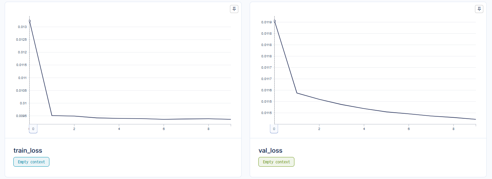
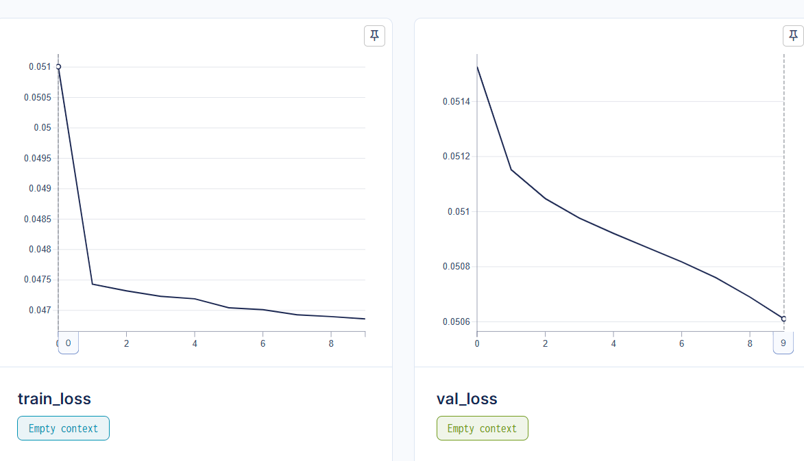
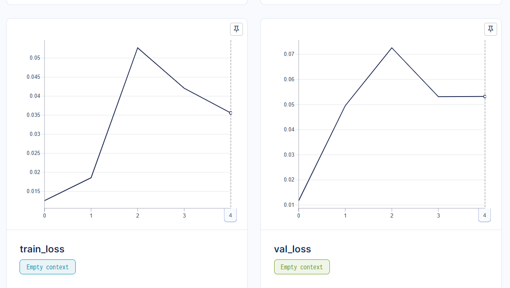
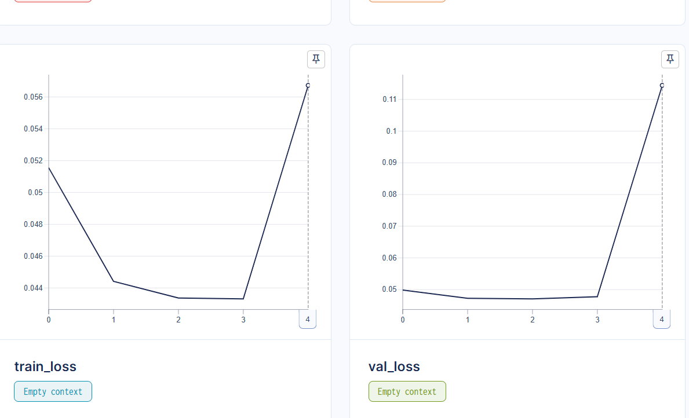

# 🌸 Классификация изображений цветов с SigLip

[](https://www.python.org/)
[](https://pytorch.org/)

## 📋 Оглавление
- [Эксперименты](#-эксперименты)
- [Установка и запуск](#-установка-и-запуск)
- [Мониторинг](#-мониторинг)


## 🧪 Эксперименты

### 1) SGD without perceptual loss
#### График loss:
<div align="center">
  
</div>

#### Результаты

Optimal Thr: 0.016327
Final TPR: 0.9302325581395349, Final TNR: 0.82537517053206


### 2) SGD with perceptual loss
#### График loss:
<div align="center">
  
</div>

#### Результаты

Optimal Thr: 0.016492
Final TPR: 0.9302325581395349, Final TNR: 0.7923601637107777


### 3) AdamW optimizer without perceptual 
#### График loss:
<div align="center">
  
</div>

#### Результаты

Optimal Thr: 0.016829
Final TPR: 0.9147286821705426, Final TNR: 0.8343792633015007


### 4) AdamW optimizer with perceptual 
#### График loss:
<div align="center">
  
</div>

#### Результаты

Optimal Thr: 0.016190
Final TPR: 0.9302325581395349, Final TNR: 0.8057298772169168

## 🚀 Установка и запуск

```bash
# Клонирование репозитория
git clone <repository-url>
cd <repository-name>

# Создание виртуального окружения
python -m venv venv
source venv/bin/activate  # Linux/MacOS
# или
venv\Scripts\activate     # Windows

# Установка зависимостей
pip3 install torch torchvision torchaudio --index-url https://download.pytorch.org/whl/cu124
pip install -r requirements.txt
```

## 📊 Мониторинг

### AIM
```bash
aim up
```