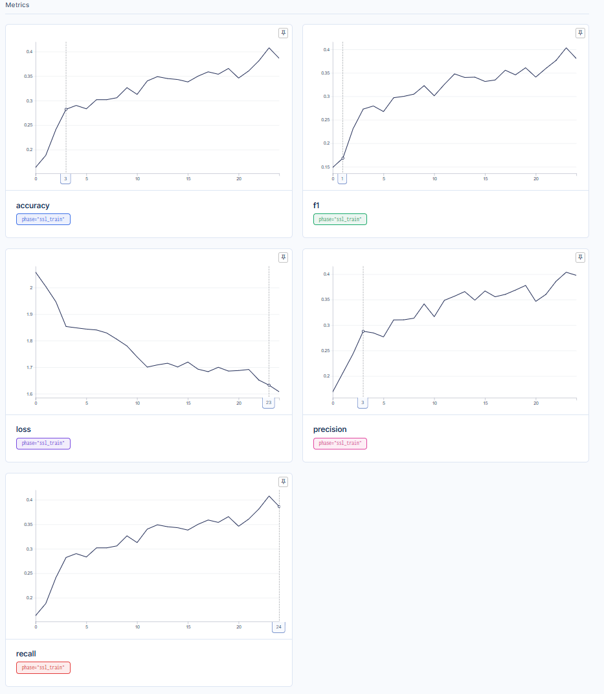
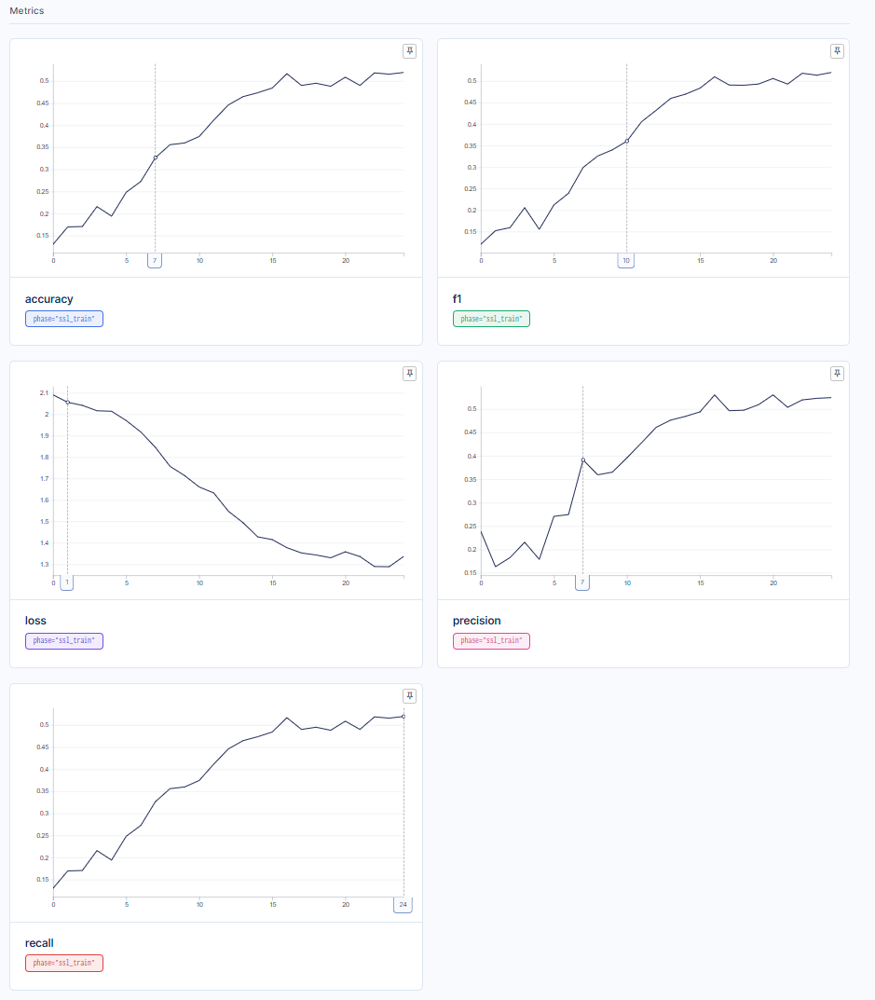
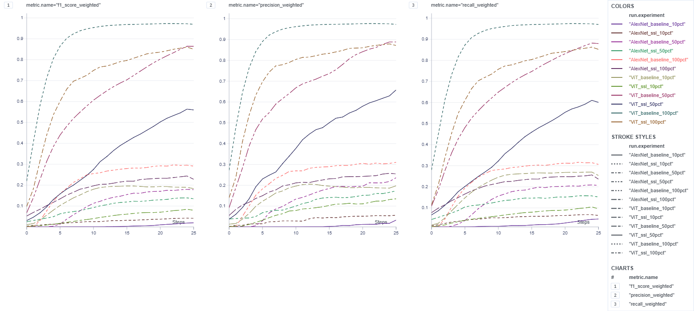

# 🌸 Классификация изображений цветов с SigLip

[](https://www.python.org/)
[](https://pytorch.org/)

## 📋 Оглавление
- [Датасет](#-датасет)
- [Результаты](#-результаты)
- [Эксперименты](#-эксперименты)
- [Установка и запуск](#-установка-и-запуск)
- [Мониторинг](#-мониторинг)


## 📊 Датасет

**Flowers102** - высококачественный датасет для классификации цветов.

### Характеристики:
- **Классы**: 102 вида цветов
- **Объем данных**: 8,189 изображений
  - 🔵 Тренировочная выборка: 6,149
  - 🟡 Валидационная выборка: 1,020
  - 🔴 Тестовая выборка: 1,020
- **Формат**: RGB изображения различного разрешения

> 🔗 [Официальная страница датасета](https://www.robots.ox.ac.uk/~vgg/data/flowers/102/)

## 📈 Результаты

### Метрики

### Визуализация обучения

<div align="center">
  
  
  
</div>

## 🧪 Эксперименты

**Ключевые наблюдения:**
- Вывод по проведенным экспериментам:

В случае обучения ViT обучение без использование претрена SSL всегда лучше на любой объем объеме данных. Мне кажется это связано с тем, что ViT уже проходил стадию претрена на гораздо большем и лучшем датасете, соотвественно в нашем эксперименте мы только портим модель таким подходом.


В случае обучения AlexNet использование SSL оправдывает себя только при выборе 10% от тренировочного датасета, в случае 50% и 100% данных бейзлайн себя показал лучше

## 🚀 Установка и запуск

```bash
# Клонирование репозитория
git clone <repository-url>
cd <repository-name>

# Создание виртуального окружения
python -m venv venv
source venv/bin/activate  # Linux/MacOS
# или
venv\Scripts\activate     # Windows

# Установка зависимостей
pip3 install torch torchvision torchaudio --index-url https://download.pytorch.org/whl/cu124
pip install -r requirements.txt
```

## 📊 Мониторинг

### AIM
```bash
aim up
```